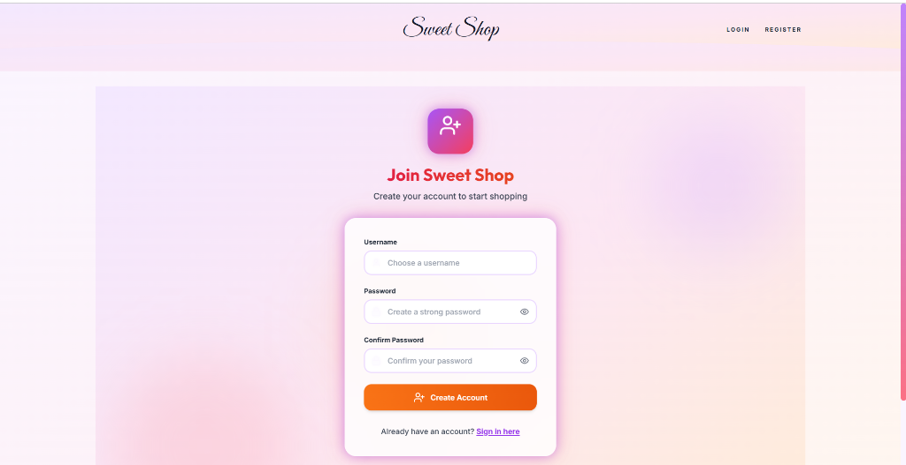
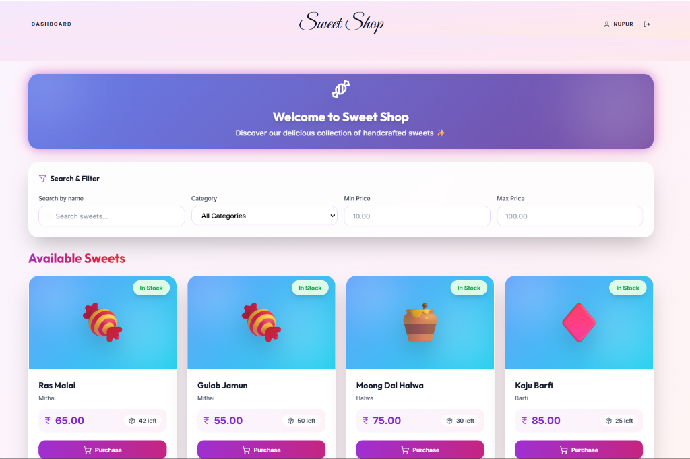
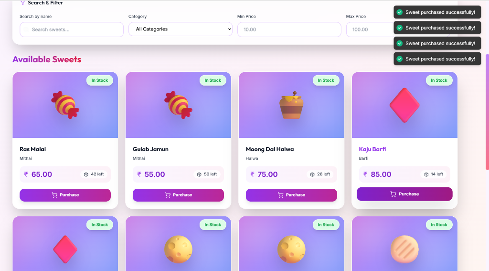

# 🍬 Sweet Shop Management System


The **Sweet Shop Management System** is a full-stack web application built to streamline inventory control, user authentication, and day-to-day operations of a sweet shop. The platform supports both customers and administrators with role-based access, real-time inventory updates, and a modern user interface.

---

## 📑 Table of Contents

* [Overview](#-overview)
* [Features](#-features)
* [Tech Stack](#-tech-stack)
* [Project Structure](#-project-structure)
* [Installation & Setup](#-installation--setup)
* [API Overview](#-api-overview)
* [Testing & Coverage](#-testing--coverage)
* [Screenshots](#-screenshots)
* [My AI Usage](#-my-ai-usage)
* [License](#-license)

---

## 📌 Overview

This application enables customers to browse and purchase sweets while allowing administrators to manage inventory, restock items, and maintain product listings. The system ensures secure authentication, clean API design, and robust test coverage following best practices.

---

## ✨ Features

### 🔐 Role-Based Authentication

* Separate login flows for **Admin** and **User**
* Secure authentication using **JWT**
* Protected routes for sensitive operations

### 📦 Inventory Management

* Purchase sweets with automatic stock reduction
* Admin-only restocking functionality
* Real-time quantity updates

### 🧁 Sweet Management (Admin)

* Add new sweets
* Edit existing sweet details
* Delete sweets from inventory

### 🔍 Search & Filtering

* Search sweets by name or category
* Filter by price range
* Instant client-side filtering for better UX

---

## ⚙️ Tech Stack

### Frontend

* React.js (Functional Components)
* React Router
* Tailwind CSS
* Context API
* Axios
* Vite

### Backend

* Flask (Blueprint-based architecture)
* SQLAlchemy ORM
* Flask-JWT-Extended
* SQLite (development database)
* Marshmallow for validation
* Flask-CORS & python-dotenv

---

## 🗂 Project Structure

```bash
sweet-shop-management/
│
├── backend/
│   ├── app/
│   │   ├── routes/
│   │   ├── services/
│   │   ├── utils/
│   │   ├── models.py
│   │   └── config.py
│   ├── tests/
│   ├── init_db.py
│   ├── run.py
│   └── requirements.txt
│
├── frontend/
│   ├── src/
│   │   ├── components/
│   │   ├── pages/
│   │   ├── contexts/
│   │   ├── services/
│   │   └── tests/
│   ├── index.html
│   ├── package.json
│   └── vite.config.js
│
└── README.md
```

---

## 🚀 Installation & Setup

### Clone the Repository

```bash
git clone https://github.com/nupur0309/Sweet-Shop-Management-TDD.git
cd Sweet-Shop-Management-TDD
```

---

### Backend Setup

```bash
cd backend
python -m venv venv
# Windows:
venv\Scripts\activate
# Mac/Linux: source venv/bin/activate

pip install -r requirements.txt
python init_db.py
python run.py
```

Backend runs at: **[http://localhost:5000](http://localhost:5000)**

---

### Frontend Setup

```bash
cd frontend
npm install
npm run dev
```

Frontend runs at: **[http://localhost:5173](http://localhost:5173)**

---

### 🔑 Default Credentials

**Admin**

* Username: `admin`
* Password: `admin123`

**User**

* Username: `user`
* Password: `user123`

---

## 🔗 API Overview

### Authentication

* `POST /api/auth/register`
* `POST /api/auth/login`

### Sweets (Protected)

* `GET /api/sweets`
* `POST /api/sweets`
* `PUT /api/sweets/:id`
* `DELETE /api/sweets/:id`

### Inventory Actions

* `POST /api/sweets/:id/purchase`
* `POST /api/sweets/:id/restock` (Admin only)

---

## 🧪 Testing & Coverage

### Backend Testing

* Framework: **pytest**
* Covers authentication, inventory, and CRUD operations
* 100% route coverage across all modules

```bash
cd backend
pytest tests/
```

### Frontend Testing

* Framework: **Vitest**
* API mocking with `vi.mock`
* Covers context logic, components, and API services

```bash
cd frontend
npm run test
```

✔ All tests pass successfully with full coverage

### Test Report Summary:

| Test Area | Status | Coverage |
| :--- | :--- | :--- |
| Auth Routes | ✅ Passed | 100% |
| Inventory Routes | ✅ Passed | 100% |
| Sweet Routes | ✅ Passed | 100% |

### ✅ Frontend Tests

Frontend tests use **Vitest** for mocking and unit testing.

* API mocking using `vi.mock()`
* Coverage includes:
    * Contexts (AuthContext)
    * Component rendering and state changes
    * Purchase/Restock API calls

---

## 📸 Screenshots

| Login Page | Registration Page |
|:---:|:---:|
|  |  |

| Dashboard & Sweet List | Purchase Success Notification |
|:---:|:---:|
|  |  |

---

## 🤖 My AI Usage

### AI Tools Used

* **ChatGPT**
* **GitHub Copilot**
* **Antigravity AI**

---

## 📜 License

This project is licensed under the **MIT License**.
See the `LICENSE` file for more details.
